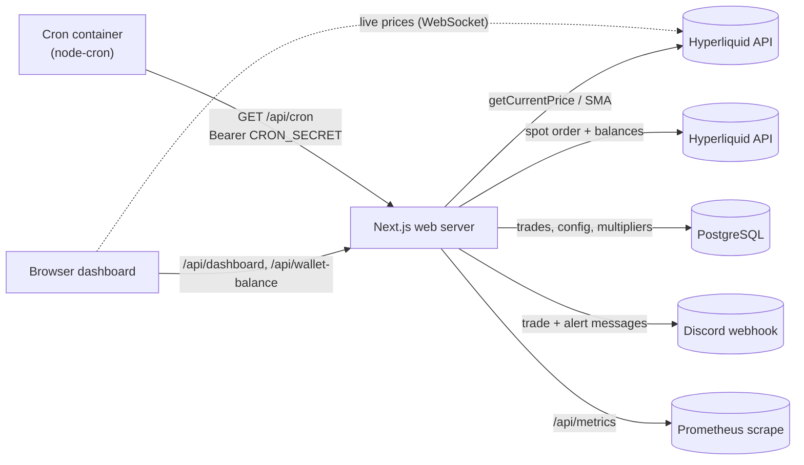
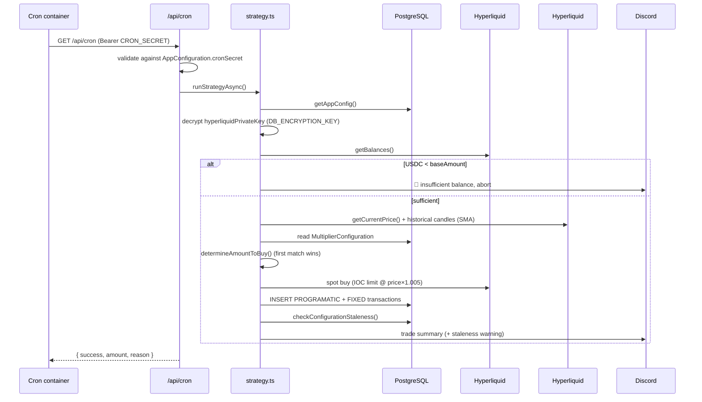

# Architecture

Smart DCA Bot is a single-user automated Bitcoin dollar-cost-averaging tool. A scheduler hits an authenticated endpoint on a fixed cron; the strategy engine fetches the current price, evaluates on-chain indicators to pick a purchase multiplier, executes a spot buy on Hyperliquid, records the trade (plus a synthetic fixed-DCA benchmark), and reports to Discord. A Next.js dashboard visualizes programmatic vs. fixed performance.

## Tech Stack

| Layer | Technology |
|-------|-----------|
| Runtime | Bun |
| Framework | Next.js 16 (App Router, standalone output) |
| Language | TypeScript (strict) |
| Database | PostgreSQL via Prisma 7 (adapter: `@prisma/adapter-pg`) |
| Exchange | Hyperliquid spot (`@nktkas/hyperliquid`), signing via `viem` |
| Price feed | Hyperliquid API via `@nktkas/hyperliquid` (`InfoClient` REST, `SubscriptionClient` WebSocket) |
| Styling | Tailwind CSS 4 + Radix UI + ShadCN |
| Charts | Recharts 3 |
| Metrics | `prom-client` (Prometheus) |
| Notifications | Discord webhook |
| Scheduler | `node-cron` (standalone container) |
| Containers | Docker (two images: web + cron) |

---

## High-Level Topology



---

## Directory Structure

```
smart-dca-bot/
├── app/
│   ├── api/
│   │   ├── cron/route.ts            # Bot execution endpoint (Bearer auth)
│   │   ├── dashboard/route.ts       # ROI aggregation for the dashboard
│   │   ├── multiplier-configuration/route.ts
│   │   ├── app-configuration/route.ts
│   │   ├── configuration-staleness/route.ts
│   │   ├── wallet-balance/route.ts
│   │   ├── trigger-bot/route.ts     # Manual run trigger from the UI
│   │   ├── test-discord/route.ts    # Send a test Discord message
│   │   ├── deploy-notify/route.ts   # Post-deploy Discord notification
│   │   ├── health/route.ts          # Readiness probe (used by cron startup)
│   │   └── metrics/route.ts         # Prometheus scrape endpoint
│   ├── settings/                    # Configuration UI (7 sub-pages)
│   ├── docs/                        # Swagger UI
│   └── page.tsx                     # Dashboard
├── lib/
│   ├── strategy.ts                  # Multiplier evaluation + DCA orchestration
│   ├── hyperliquid-bot.ts           # Hyperliquid spot order execution
│   ├── hyperliquid.ts               # Hyperliquid price feed + SMA calculation
│   ├── discord.ts                   # Discord webhook delivery
│   ├── notifications.ts             # Notification fan-out (wraps discord.ts)
│   ├── app-config.ts                # AppConfiguration read/write (DB-backed)
│   ├── configuration-staleness.ts   # Stale-config detection
│   ├── key-expiry.ts                # Hyperliquid API key 180-day expiry warning
│   ├── encryption.ts                # AES-256-GCM encrypt/decrypt for the API key
│   ├── db.ts                        # Prisma singleton with pg pool
│   ├── logger.ts                    # Structured logger with redaction
│   └── metrics.ts                   # Prometheus metrics registry
├── scripts/
│   └── cron.ts                      # node-cron scheduler (calls /api/cron)
├── prisma/
│   └── schema.prisma                # Data models
├── generated/prisma/                # Generated Prisma client (gitignored output)
├── Dockerfile                       # Next.js web server image
├── Dockerfile.cron                  # Cron scheduler image
└── AGENTS.md                        # Agent roles and boundaries
```

---

## Execution Flow

A scheduled tick from the cron container drives the whole strategy:



Notes:
- The buy retries up to 3 times on transient errors. `InsufficientBalanceError` and "Insufficient spot balance" are non-retryable.
- If an order is sent but the outcome is ambiguous (HTTP response on error, `resting`, or unknown status), `hyperliquid-bot.ts` throws `TransactionSentError` and the strategy does **not** retry — see [docs/RELIABILITY.md](docs/RELIABILITY.md).

---

## Key Architectural Decisions

### DB-Backed Configuration

All operational settings (base amount, Hyperliquid symbol, low-balance threshold, cron secret, Discord webhook, encrypted API key, staleness thresholds) live in the single-row `AppConfiguration` table and are editable at runtime via `/settings`. `lib/app-config.ts`'s `getAppConfig()` reads the row directly — there is **no** environment-variable fallback for these fields.

Only two values are ENV-only and required before any DB read:
- `DATABASE_URL` — needed to connect to PostgreSQL
- `DB_ENCRYPTION_KEY` — used to encrypt/decrypt the Hyperliquid API private key stored in the DB

The Hyperliquid API wallet credentials (private key, wallet address, key creation date) are stored in the database and configured at `/settings/hyperliquid`. The private key is encrypted with AES-256-GCM (`lib/encryption.ts`).

### Module-Mock Testing Seam

`strategy.ts` imports its collaborators (Prisma, the price feed, the Hyperliquid bot, notifications) directly rather than through injected interfaces. Tests isolate it with Bun's `mock.module()`, which replaces an entire module before the unit under test imports it. Because `mock.module()` leaks across a process, `run-tests.sh` runs **each test file in its own `bun test` process**. See [docs/QUALITY_SCORE.md](docs/QUALITY_SCORE.md).

### Dual DCA Tracking

Every execution writes two `Transaction` rows:
- `DCAType.PROGRAMATIC` — the actual purchase (multiplier-adjusted amount)
- `DCAType.FIXED` — what a fixed DCA strategy would have bought (`baseAmount / btcPrice`)

Only the `PROGRAMATIC` amount is executed on-chain; `FIXED` is a synthetic benchmark. `/api/dashboard` uses the parallel records to calculate the ROI comparison.

### Priority-Based Multiplier Evaluation

Only the first matching multiplier condition applies — no stacking. Evaluation order **as implemented** in `determineAmountToBuyAsync()`:

1. `LTH_REALIZED_PRICE`
2. `LTH_BUYING`
3. `AVERAGE_REALIZED_PRICE`
4. `MOVING_AVERAGE`

Multiplier values are configurable per row, not hardcoded. The intended priority swaps (2) and (3) — see TD-005 in [docs/exec-plans/tech-debt-tracker.md](docs/exec-plans/tech-debt-tracker.md). Full spec: [docs/design-docs/multiplier-strategy.md](docs/design-docs/multiplier-strategy.md).

### Double-Spend Guard

When a Hyperliquid order may have been sent but the outcome is ambiguous, `hyperliquid-bot.ts` throws `TransactionSentError` (not a generic error). `strategy.ts` catches it specifically, sends a Discord alert, and does not retry — preventing a double-spend. The order details are logged for manual verification.

---

## Data Models

See [docs/generated/db-schema.md](docs/generated/db-schema.md) for the full schema. Summary:

- **`Transaction`** (`transactions`) — append-only trade ledger. Columns: `id`, `date`, `amount`, `price`, `reason`, `dcaType` (`FIXED` | `PROGRAMATIC`).
- **`MultiplierConfiguration`** (`multiplier_configuration`) — one row per indicator (`type` is unique). Columns: `value`, `multiplier`, `enabled`, `updatedAt` (drives staleness).
- **`AppConfiguration`** (`app_configuration`) — single row (`id = "default"`). All DB-backed settings, including the encrypted Hyperliquid API key.

---

## Deployment

Two Docker images are built for `linux/amd64`:

### Web Server (`Dockerfile`)

Multi-stage build (deps → builder with Prisma generate + Next.js build → runner).

- Base: `oven/bun:1`
- Runs as non-root user `nextjs` (uid 1001)
- Exposes port 3001
- Entrypoint: `bun server.js` (Next.js standalone output)
- Includes `curl` for health checks

### Cron Scheduler (`Dockerfile.cron`)

Minimal image running only `scripts/cron.ts`.

- Base: `oven/bun:1-alpine`
- Installs production deps only (`--ignore-scripts` skips Prisma generate)
- Entrypoint: `bun run scripts/cron.ts`
- Polls `GET /api/health` until the web server is ready before scheduling
- Default schedule: `0 0,12 * * *` (midnight and noon UTC), overridden by `CRON_EXPRESSION`
- Calls `GET /api/cron` with `Authorization: Bearer <CRON_SECRET>` on each tick

Local development uses Docker Compose (`docker compose up app`, plus `--profile cron` for the scheduler); see [README.md](README.md). CI runs lint + tests on pull requests via `.github/workflows/pr-checks.yml`.

### Environment Variables (runtime)

| Variable | Required | Notes |
|----------|----------|-------|
| `DATABASE_URL` | Yes | PostgreSQL connection string |
| `DB_ENCRYPTION_KEY` | Yes (web) | 32-byte hex key (AES-256-GCM) for the Hyperliquid API private key. Generate with `openssl rand -hex 32` |
| `CRON_SECRET` | Yes (cron) | Bearer secret the cron container sends; must match `AppConfiguration.cronSecret` |
| `API_URL` | No | Cron container target (default `http://localhost:3001`) |
| `CRON_EXPRESSION` | No | Overrides the default schedule |
| `LOG_LEVEL` | No | `DEBUG`, `INFO`, `WARN`, `ERROR`, `SILENT` (default `INFO`) |
| `ENABLE_LOGS` | No | Set to `"false"` to disable all logging |
| `TEST_MODE` | No | Buffers logs in memory; cron container runs the bot immediately on startup |

> All `AppConfiguration` fields (base amount, Discord webhook, cron secret, Hyperliquid credentials, etc.) are configured in the DB via `/settings`, **not** via environment variables.

## Cross-References

- Agent roles and boundaries: [AGENTS.md](AGENTS.md)
- Multiplier strategy: [docs/design-docs/multiplier-strategy.md](docs/design-docs/multiplier-strategy.md)
- Reliability (retries, double-spend guard, metrics): [docs/RELIABILITY.md](docs/RELIABILITY.md)
- Security (auth, key handling, redaction): [docs/SECURITY.md](docs/SECURITY.md)
- Database schema: [docs/generated/db-schema.md](docs/generated/db-schema.md)
- Frontend architecture: [docs/FRONTEND.md](docs/FRONTEND.md)
