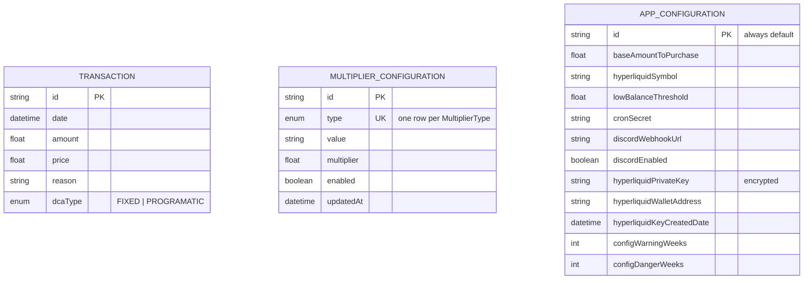

<!-- GENERATED — Do not edit manually. Regenerate from `prisma/schema.prisma`. -->

# Database Schema

Generated from `prisma/schema.prisma`. Database: PostgreSQL (via `@prisma/adapter-pg`). Prisma client output: `generated/prisma`.

The three models are independent — there are no foreign-key relationships between them. `Transaction` is an append-only trade ledger, `MultiplierConfiguration` holds one row per indicator, and `AppConfiguration` is a single-row settings table.

---

## Enums

### `DCAType`

| Value | Description |
|-------|-------------|
| `FIXED` | Simulated fixed-amount purchase recorded for comparison |
| `PROGRAMATIC` | Actual purchase with multiplier-adjusted amount |

### `MultiplierType`

| Value | Description |
|-------|-------------|
| `MOVING_AVERAGE` | N-day simple moving average indicator (lookback configurable via `value`) |
| `LTH_REALIZED_PRICE` | Long-term holder realized price indicator |
| `AVERAGE_REALIZED_PRICE` | Market-wide average realized price indicator |
| `LTH_BUYING` | Long-term holder net-change flag (`"true"`/`"false"`) |

---

## Models

### `Transaction`

Table: `transactions`

Records every trade execution. Both a `PROGRAMATIC` and a `FIXED` row are written per cron run to enable ROI comparison (see [core-beliefs.md](../design-docs/core-beliefs.md)).

| Column | DB column | Type | Constraints | Default | Notes |
|--------|-----------|------|-------------|---------|-------|
| `id` | `id` | `String` | `@id` | `uuid()` | Primary key |
| `date` | `date` | `DateTime` | — | `now()` | Execution timestamp |
| `amount` | `amount` | `Float` | — | — | Token quantity purchased (BTC for `PROGRAMATIC`; `baseAmount / price` for `FIXED`) |
| `price` | `price` | `Float` | — | — | BTC price at execution, USD |
| `reason` | `reason` | `String` | `VarChar(256)` | — | Multiplier label that fired (e.g. `"Below LTH Realized Price"`) or `"Normal DCA"` |
| `dcaType` | `dca_type` | `DCAType` | — | — | `FIXED` or `PROGRAMATIC` |

**Indexes:** `dcaType`, `date`

---

### `MultiplierConfiguration`

Table: `multiplier_configuration`

One row per `MultiplierType`. Stores the reference value and the multiplier applied when that indicator's condition is met. The strategy engine evaluates these in priority order and applies the first match (see [multiplier-strategy.md](../design-docs/multiplier-strategy.md)).

| Column | DB column | Type | Constraints | Default | Notes |
|--------|-----------|------|-------------|---------|-------|
| `id` | `id` | `String` | `@id` | `uuid()` | Primary key |
| `type` | `multiplier_type` | `MultiplierType` | `@unique` | — | Indicator type; one row per type |
| `value` | `value` | `String` | `VarChar(64)` | — | Reference value as string: price (realized prices), days (MA), or `"true"`/`"false"` (LTH buying). Manually updated weekly |
| `multiplier` | `multiplier` | `Float` | — | — | Purchase multiplier when the condition is met (e.g. `2.0` = double) |
| `enabled` | `enabled` | `Boolean` | — | `true` | Whether this indicator is evaluated |
| `updatedAt` | `updated_at` | `DateTime` | `@updatedAt` | `now()` | Auto-updated on write; drives staleness checks |

**Indexes:** `type`, `updatedAt`

---

### `AppConfiguration`

Table: `app_configuration`

Single-row table (`id` always `"default"`). Holds all runtime configuration managed via the Settings UI. Read with `getAppConfig()` in `lib/app-config.ts`, which reads the DB row directly — there is **no** environment-variable fallback for these fields. Secrets (`hyperliquidPrivateKey`, `cronSecret`, `discordWebhookUrl`, `hyperliquidWalletAddress`) are masked as `"••••••••"` in `GET /api/app-configuration` responses.

| Column | DB column | Type | Default | Notes |
|--------|-----------|------|---------|-------|
| `id` | `id` | `String` | `"default"` | Always `"default"` — single row |
| `baseAmountToPurchase` | `base_amount_to_purchase` | `Float` | `5` | Base USD amount per purchase before multipliers |
| `hyperliquidSymbol` | `hyperliquid_symbol` | `String` | `"BTC"` | Symbol used to fetch price data from the Hyperliquid feed |
| `lowBalanceThreshold` | `low_balance_threshold` | `Float` | `100` | USDC balance below this triggers a Discord warning |
| `cronSecret` | `cron_secret` | `String` | `""` | Bearer secret validated on `/api/cron`. Empty string disables the check |
| `discordWebhookUrl` | `discord_webhook_url` | `String` | `""` | Discord webhook for trade/failure notifications |
| `discordEnabled` | `discord_enabled` | `Boolean` | `true` | Master toggle for Discord notifications |
| `hyperliquidPrivateKey` | `hyperliquid_private_key` | `String` | `""` | API wallet private key, encrypted at rest (AES-256-GCM) with `DB_ENCRYPTION_KEY` |
| `hyperliquidWalletAddress` | `hyperliquid_wallet_address` | `String` | `""` | Master wallet address used for balance queries |
| `hyperliquidKeyCreatedDate` | `hyperliquid_key_created_date` | `DateTime?` | `null` | When the API key was generated; drives the 180-day expiry warning |
| `configWarningWeeks` | `config_warning_weeks` | `Int` | `1` | Weeks before a staleness warning is shown |
| `configDangerWeeks` | `config_danger_weeks` | `Int` | `2` | Weeks before a staleness danger alert is shown |
| `updatedAt` | `updated_at` | `DateTime` | `now()` | Auto-updated on write |

---

## Relationships diagram

The models are standalone (no FKs). The diagram shows their columns and how the application relates them at runtime.

